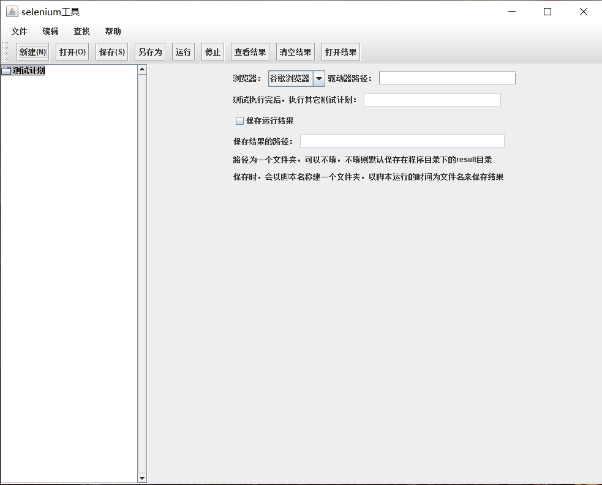

# 源码使用说明  
1. king.selenium.start，这个包单独打包成Start.jar，对应Selenium.zip压缩包里的Start.jar
2. king.selenium.base，这个包单独打包成SeleniumContext.jar，对应压缩包里lib下的SeleniumContext.jar
3. king.selenium.init，这个包单独打包成SeleniumInit.jar，对应压缩包里lib/ext下的SeleniumInit.jar
4. 剩下的包，打包成SeleniumGUI.jar，这就是压缩包里的主程序了。通常情况下，前面三个包是不用修改的，所以下载源码  
后可以从源码中将它们删除掉，做二次开发，只需要在剩下的包里面，进行修改即可  

**举例说明：** 在king.selenium.data包下，有DriverType类，这是一个枚举类，现在这个枚举类中只定义了三种浏览器：  
谷歌浏览器、火狐浏览器、IE浏览器，如果需要使用其它的浏览器，只需要再添加一个枚举类就可以了，四个参数的含义，在  
类文件中也有相应的注释。  
***
程序的使用，在selenium.zip中有详细的使用说明，解压之后，就可以查看  
### 程序截图

